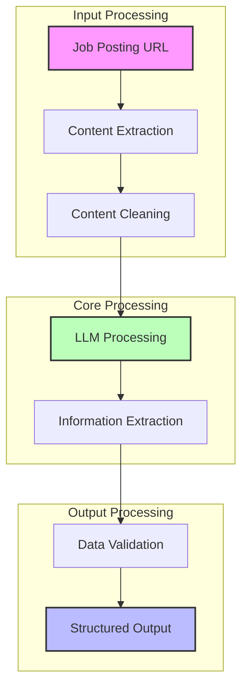

# Job Description Extractor - Technical Requirements

## Overview
The Job Description Extractor is a component that processes job posting URLs to extract structured information for resume tailoring. It focuses on extracting relevant information that helps optimize a resume for interview selection.

## Core Concepts

### Input Processing
- Accepts job posting URLs
- Handles various job board formats
- Processes web content
- Manages content extraction

### Data Extraction
- Uses LLM for intelligent content processing
- Extracts structured information
- Identifies key job requirements
- Processes both technical and non-technical aspects

### Data Structure
The extractor organizes job information into the following categories:
- Company information
- Job title and summary
- Role responsibilities
- Required qualifications
- Technical skills
- Non-technical skills
- ATS-optimized keywords

### Content Processing
- Removes irrelevant content
- Preserves important formatting
- Normalizes extracted data
- Validates information completeness

### Error Management
- Handles inaccessible URLs
- Manages content extraction failures
- Processes incomplete information
- Handles processing errors

## Data Flow

## Output Format
The extracted information is structured into a standardized format containing:
- Company details
- Job specifications
- Required skills
- Qualifications
- ATS keywords
- Technical requirements
- Non-technical requirements 