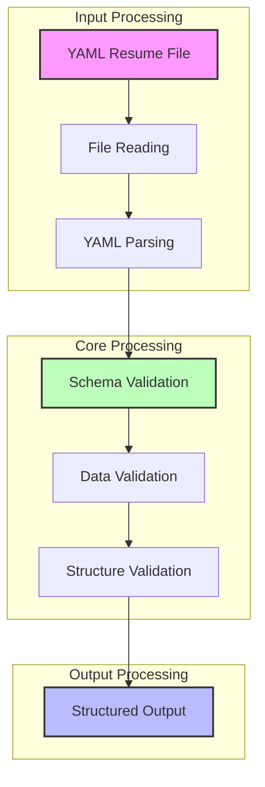

# Resume Parser - Technical Requirements

## Overview
The Resume Parser is a component that processes YAML-formatted resume data to create validated and structured information for resume tailoring. It focuses on ensuring data integrity and format consistency to enable effective resume customization.

## Core Concepts

### Input Processing
- Accepts YAML-formatted resume files
- Validates YAML syntax
- Handles file reading operations
- Manages input validation

### Data Validation
- Enforces schema compliance
- Validates data types and formats
- Ensures required fields are present
- Maintains data structure integrity

### Data Structure
The parser organizes resume information into the following categories:
- Personal information
- Professional summary
- Work experience
- Education
- Technical skills
- Projects
- Certifications
- Additional sections

### Content Processing
- Validates date formats
- Checks for required fields
- Ensures data type consistency
- Validates section structure

### Error Management
- Handles invalid YAML syntax
- Manages missing required fields
- Processes invalid data types
- Handles malformed content

## Data Flow

## Output Format
The validated information is structured into a standardized format containing:
- Personal details
- Professional information
- Work history
- Educational background
- Skills and competencies
- Project experience
- Professional certifications
- Additional qualifications 