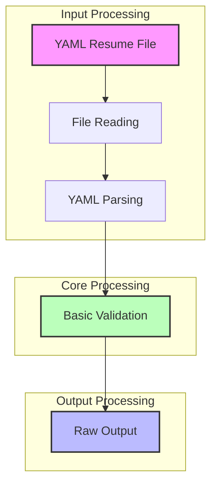

# Resume Parser - Technical Requirements

## Overview
The Resume Parser is a component that reads and validates YAML-formatted resume data. It focuses on ensuring data integrity and basic structure validation to provide clean data for the Resume Tailor.

## Core Concepts

### Input Processing
- Accepts YAML-formatted resume files
- Validates YAML syntax
- Handles file reading operations
- Manages basic input validation

### Data Validation
- Validates YAML structure
- Ensures required fields are present
- Validates basic data types
- Maintains data integrity

### Error Management
- Handles invalid YAML syntax
- Manages missing required fields
- Processes invalid data types
- Handles malformed content

## Data Flow

## Output Format
The parser returns the raw YAML data structure as provided in the input file, with basic validation ensuring:
- Valid YAML syntax
- Required fields present
- Basic data types correct
- No malformed content 