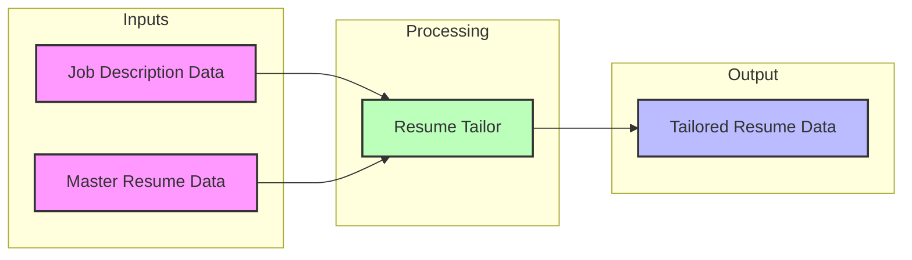
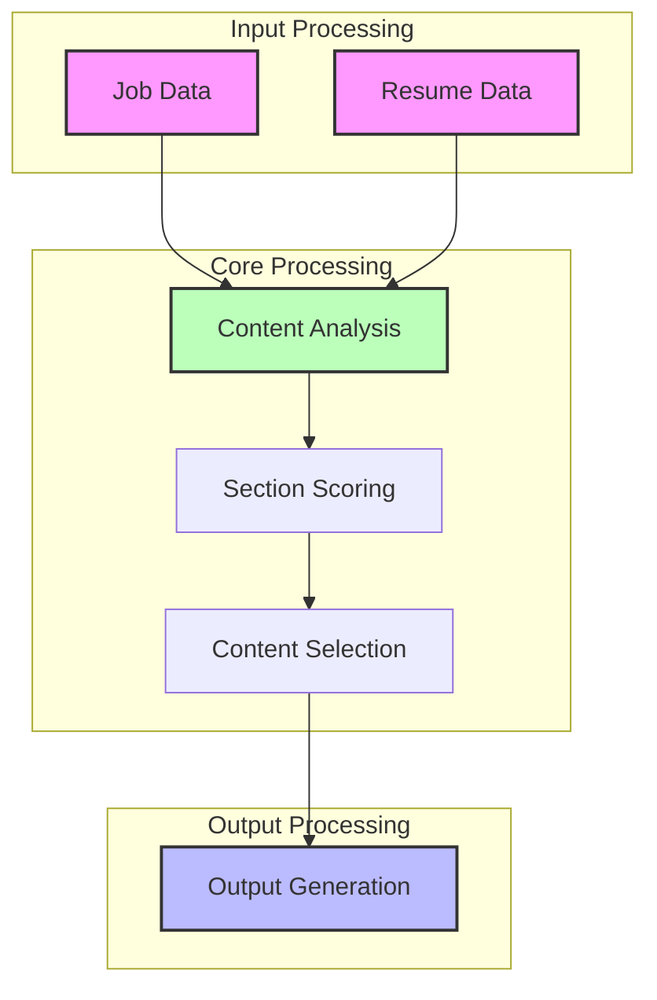

# Resume Tailor - Technical Requirements

## Overview
The Resume Tailor is a component that creates customized versions of resumes by analyzing job requirements and matching them with resume content. It focuses on highlighting relevant experience and skills while maintaining professional tone and narrative coherence.

## Core Concepts

### Input Processing
- Accepts structured job description data
- Accepts structured master resume data
- Validates input compatibility
- Ensures data completeness

### Content Analysis
- Matches job requirements with resume content
- Identifies relevant skills and experiences
- Scores section relevance
- Maintains narrative coherence

### Output Generation
- Creates tailored resume data
- Preserves resume structure
- Optimizes for ATS
- Maintains professional tone

### Error Management
- Handles missing data
- Manages content mismatches
- Processes validation errors
- Maintains data integrity

## Data Flow

## Output Format
The tailored resume maintains the same structure as the input resume with:
- Reordered sections by relevance
- Highlighted matching content
- Optimized keywords
- Preserved formatting 

## Implementation Approach

### Content Analysis & Scoring
- Score all experience entries against job requirements
- Identify natural keyword matches in existing content
- Map similar achievements and experiences
- Mark content for potential consolidation

**Why:** Create comprehensive relevance mapping while preserving all content

### Smart Content Refinement
- Combine similar achievements based on relevance scores
- Preserve strongest original phrasing and style
- Reorder content by relevance while maintaining narrative flow
- Generate role-specific professional summary

**Why:** Optimize content organization while maintaining authentic voice

### ATS Optimization
- Insert required keywords in appropriate sections

**Why:** Ensure resume passes automated screening
