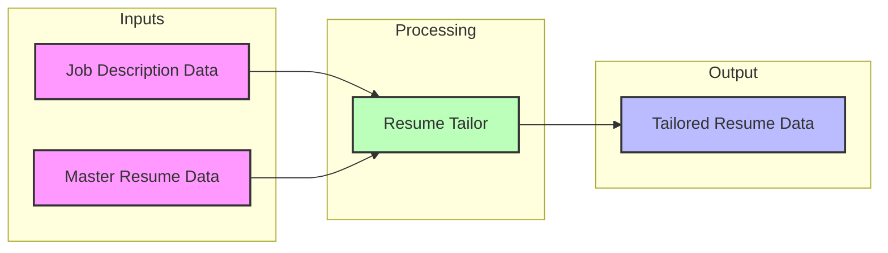
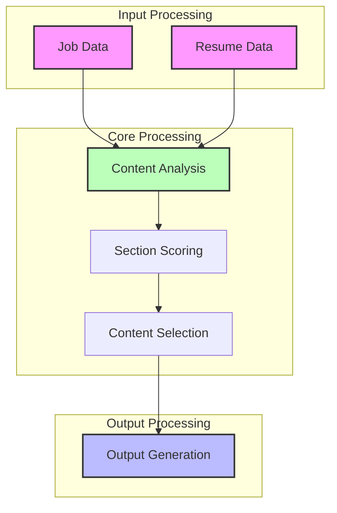
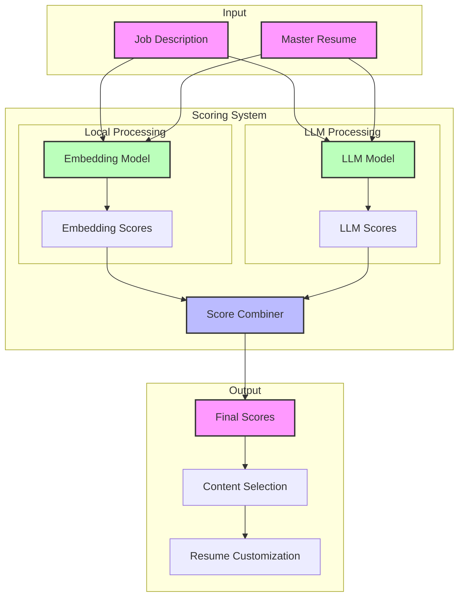
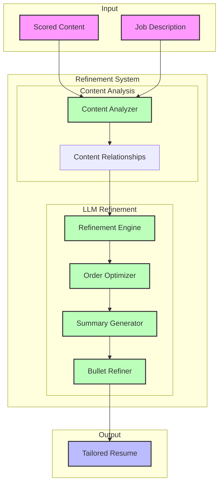

# Resume Tailor - Technical Requirements

## Overview
The Resume Tailor is a component that creates customized versions of resumes by analyzing job requirements and matching them with resume content. It focuses on highlighting relevant experience and skills while maintaining professional tone and narrative coherence.

## Core Concepts

### Input Processing
- Accepts structured job description data
- Accepts structured master resume data
- Validates input compatibility
- Ensures data completeness

### Content Analysis
- Matches job requirements with resume content
- Identifies relevant skills and experiences
- Scores section relevance
- Maintains narrative coherence

### Output Generation
- Creates tailored resume data
- Preserves resume structure
- Optimizes for ATS
- Maintains professional tone

### Error Management
- Handles missing data
- Manages content mismatches
- Processes validation errors
- Maintains data integrity

## Data Flow

## Output Format
The tailored resume maintains the same structure as the input resume with:
- Reordered sections by relevance
- Highlighted matching content
- Optimized keywords
- Preserved formatting 

## Implementation Approach

### Content Analysis & Scoring

#### Overview
The scoring system:
- Processes all experience entries against job requirements
- Identifies natural keyword matches in existing content
- Provides relevance scores for content selection
- Feeds into content selection and resume customization

**Why:** Create comprehensive relevance mapping while preserving all content, using both efficient local processing and advanced semantic understanding. The hybrid approach ensures both speed and accuracy in matching experiences to job requirements.

#### Implementation

The scoring system uses a hybrid approach combining two complementary scoring mechanisms:

1. **Local Embedding-Based Scoring**
   - Processes text locally using pre-trained embeddings
   - Provides fast, efficient semantic similarity matching
   - Handles basic semantic relationships and keyword matching
   - No ongoing API costs after initial model download

2. **LLM-Based Scoring**
   - Uses advanced language models for nuanced understanding
   - Processes experiences in batches for efficiency
   - Provides deeper context and relationship analysis
   - Handles complex semantic relationships

### Smart Content Refinement

#### Overview

The refinement system:
- Uses a single LLM call to process all content refinement tasks
- Leverages scoring results to guide content organization
- Maintains professional tone and narrative flow
- Optimizes content for both human readers and ATS
- Preserves the original voice while enhancing relevance

**Why:** Create a polished, professional resume that effectively communicates the candidate's qualifications while maintaining authenticity and optimizing for both human readers and automated systems. The single LLM approach ensures consistency across all refinement tasks while minimizing API calls.

#### Implementation

The refinement system processes scored content to create an optimized resume using a single LLM-based refinement step:

1. **Input Processing**
   - Scored content containing:
     - Original resume content
     - Relevance scores and relationships
     - Similar content mappings
   - Job description for context and requirements

2. **Content Organization**
   - Combines similar experiences based on scoring results
   - Preserves strongest original phrasing and style
   - Maintains narrative flow and career progression
   - Optimizes section ordering by relevance

3. **Content Enhancement**
   - Generates role-specific professional summary
   - Refines bullet points for impact and clarity
   - Ensures consistent tone and style
   - Maintains authentic voice and achievements

### ATS Optimization
- Insert required keywords in appropriate sections
- Ensure proper formatting and structure
- Optimize content for machine readability
- Maintain natural language flow

**Why:** Ensure resume passes automated screening while remaining engaging for human readers
