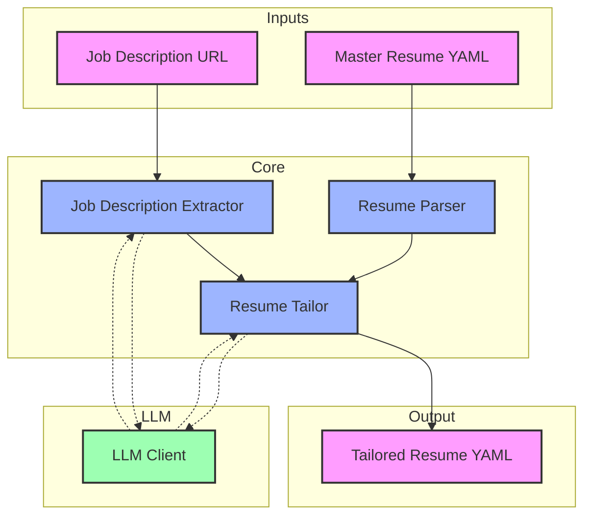

# Resume Tailor - Technical Overview



## Module Overview

The Resume Tailor module is designed to automatically tailor resumes to specific job descriptions. It processes a master resume and a job description to create a targeted version of the resume that highlights relevant experience and skills.

## Core Components

### 1. Job Description Extractor
- **Purpose**: Extracts structured information from job posting URLs
- **Input**: URL of job posting
- **Output**: Structured job description data
- **Key Features**:
  * Web scraping capabilities
  * Content extraction
  * Structured data generation
  * Error handling for various web formats

### 2. Resume Parser
- **Purpose**: Handles YAML-based resume data
- **Input**: YAML-formatted resume data
- **Output**: Validated and structured resume data
- **Key Features**:
  * YAML parsing and validation
  * Data structure enforcement
  * Error handling for malformed data
  * Format preservation

### 3. Resume Tailor
- **Purpose**: Creates tailored versions of resumes
- **Input**: Job description data + Master resume data
- **Output**: Tailored resume data
- **Key Features**:
  * Content relevance analysis
  * Section selection
  * Narrative coherence
  * Professional tone maintenance

### 4. LLM Integration Layer
- **Purpose**: Provides AI capabilities to the module
- **Key Features**:
  * Abstracted LLM client interface
  * Provider-agnostic design
  * Error handling and retries
  * Response formatting

## Component Interactions

### Data Flow
1. Job Description Processing:
   ```
   URL → Scraper → Job Description Extractor → Structured Job Data
   ```

2. Resume Processing:
   ```
   YAML File → Resume Parser → Validated Resume Data
   ```

3. Tailoring Process:
   ```
   Job Data + Resume Data → Resume Tailor → Tailored Resume
   ```

### LLM Integration
- Job Description Extractor uses LLM for:
  * Content extraction
  * Structure identification
  * Format normalization

- Resume Tailor uses LLM for:
  * Content relevance analysis
  * Section scoring
  * Narrative generation

## Error Handling

Each component implements its own error handling:
- Scraper: Network and format errors
- Parser: Data validation and structure errors
- Tailor: Content processing errors
- LLM: API and response errors

## Extensibility

The module is designed for extensibility:
- New LLM providers can be added
- Additional scraping methods can be implemented
- Custom tailoring rules can be defined
- New resume formats can be supported

## Dependencies

External dependencies are managed through:
- Python package management
- Environment configuration
- API key management
- Version control

## Future Considerations

Potential areas for expansion:
- Additional job board support
- Enhanced tailoring algorithms
- Custom resume formats
- Batch processing capabilities
- API endpoints for web integration 